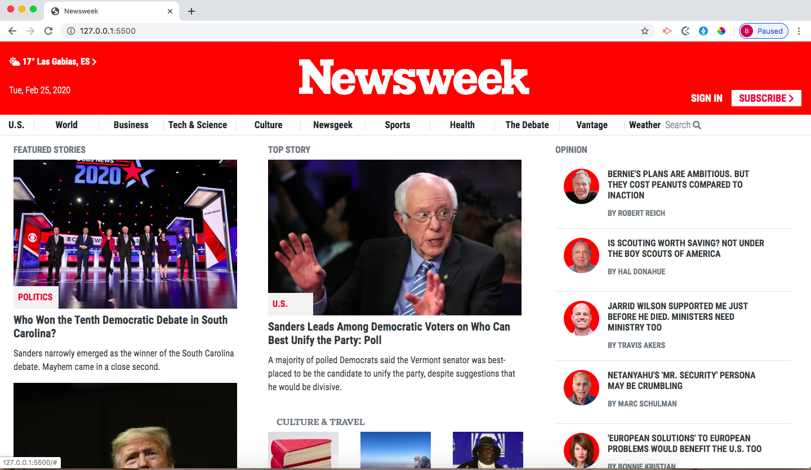

# newsweek-clone

> For this project, I was tasked with building a clone of the <a href="https://www.newsweek.com"> Newsweek webpage</a>  using Twitter's Bootstrap framework. 

## Built With

- HTML 5
- CSS 3
- BOOTSTRAP 4

## Live Demo

[Live Demo Link](https://brittanyblake.github.io/Apple-clone/)

## Authors

👤 **Brittany Blake**

- Github: [@BrittanyBlake](https://github.com/BrittanyBlake)
- Twitter: [@bbcodes_](https://twitter.com/bbcodes_)
- Linkedin: [Brittany Blake](https://www.linkedin.com/in/brittany-blake-843951109/)

## 🤝 Contributing

Contributions, issues and feature requests are welcome!

Feel free to check the [issues page](https://github.com/BrittanyBlake/newsweek-clone/issues).

## Show your support

Give a ⭐️ if you like this project!

## 📝 License

This project is [MIT](lic.url) licensed.
